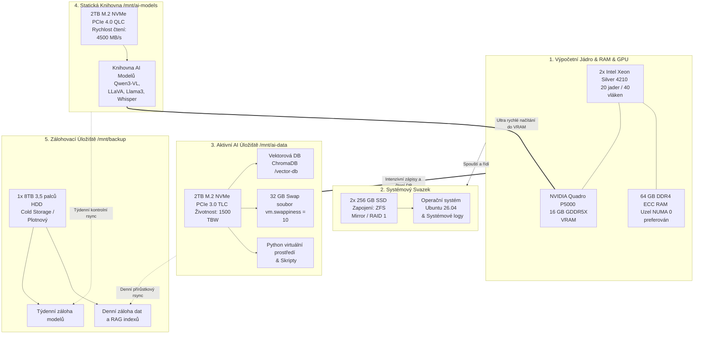
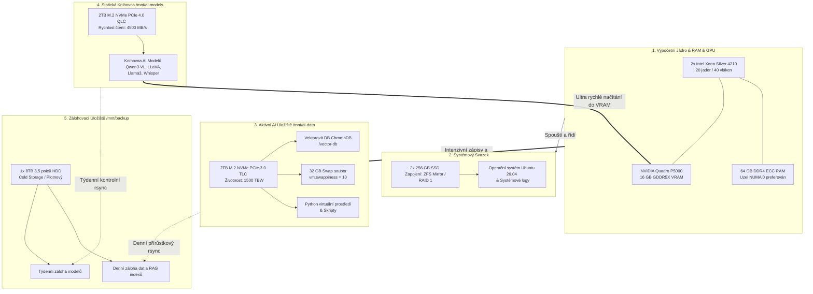
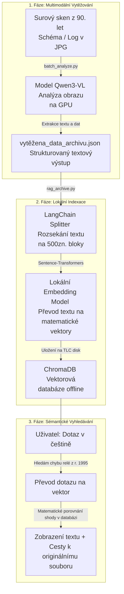

# 🏠 Průvodce instalací lokálního AI prostředí na Lenovo ThinkStation P720

Vítejte v dokumentaci pro nasazení open-source umělé inteligence na vlastním hardwaru. Tento návod slouží jako kompletní, krok za krokem přehled a konfigurační kuchařka pro GitHub Pages. Všechny popsané modely a postupy jsou navrženy pro plně offline provoz, bez odesílání dat na internet a bez licenčních poplatků. Cílem je bezpečná analýza interních dokumentů, historických schémat a 30letého firemního archivu.

---

## 🖥️ Hardwarová a softwarová specifikace

### Hardware
* **Stroj:** Lenovo ThinkStation P720 Tower Workstation
* **Procesor:** 2x Intel Xeon Silver 4210 (Celkem 20 fyzických jader, 40 vláken, NUMA topologie)
* **Operační paměť:** 64 GB DDR4 ECC RAM
* **Grafická karta:** NVIDIA Quadro P5000 (16 GB GDDR5X VRAM, architektura Pascal)
* **Úložiště (Asymetrická AI Topologie):**
  * **Systémové disky:** 2x 256 GB SSD v zapojení ZFS Mirror (RAID 1) – vyhrazeno pro OS a systémové logy.
  * **NVMe Disk 1 (Aktivní Data a RAG):** 2TB M.2 PCIe 3.0 TLC (3100/2200 MB/s, vysoká životnost 1500 TBW) – dedikovaný pro neustálé zápisy vektorových databází, indexy a python prostředí. Namontován na `/mnt/ai-data`.
  * **NVMe Disk 2 (Úložiště LLM Modelů):** 2TB M.2 PCIe 4.0 QLC (4500/4000 MB/s, rychlé čtení, 600 TBW) – dedikovaný pro statické ukládání LLM/GGUF modelů. Využívá maximální rychlost čtení pro okamžité načítání modelů do VRAM. Namontován na `/mnt/ai-models`.
  * **Zálohovací disk:** 1x 8TB 3,5" HDD (plotnový) – určen pro denní inkrementální zálohy a cold-storage obou NVMe disků.

### Software
* **Operační systém:** Ubuntu 26.04 LTS (Noble Numbat – jádro s nativní podporou NUMA a symetrického multiprocessingu)
* **Základy:** Python 3.10+, Git, pip, wget, curl, vim, docker (volitelně)

---

# 💾 Konfigurace odkládací paměti (Swap) pro AI Workstation

Při provozu lokálních AI modelů a indexaci velkých datových objemů (30letý archiv) je swap naprosto kritickou pojistkou stability. Pokud paměťové nároky přesáhnou fyzických 64 GB RAM, swap zabrání pádu běžících AI procesů (chyba Out of Memory). 

Díky kombinaci 64 GB fyzické RAM a 32 GB Swapu získá systém celkem 96 GB alokovatelného prostoru.

---

## 🎯 Strategie umístění Swapu

Z hlediska asymetrické hardwarové topologie serveru Lenovo P720 je swap nakonfigurován následovně:

* **Umístění:** Výhradně na PCIe 3.0 TLC disku (/mnt/ai-data).
* **Důvod:** Swap generuje obrovské množství drobných a neustálých zápisů. Druhý PCIe 4.0 QLC disk (/mnt/ai-models) má nízkou životnost (pouze 600 TBW) a swap by ho velmi rychle zničil. TLC disk s životností 1500 TBW je pro tuto zátěž ideální. Provoz swapu na systémovém ZFS mirroru se nedoporučuje kvůli riziku zacyklení paměti (deadlock).

---

## ⚙️ Krok za krokem: Vytvoření 32 GB Swap souboru

V moderním Ubuntu 26.04 LTS je nejefektivnějším řešením vytvoření swap souboru přímo na datovém TLC svazku. Postupujte podle těchto příkazů v terminálu:

    # 1. Alokujte 32 GB prostor pro swap soubor na rychlém TLC disku
    sudo fallocate -l 32G /mnt/ai-data/swapfile

    # 2. Nastavte striktní přístupová práva (bezpečnostní standard)
    sudo chmod 600 /mnt/ai-data/swapfile

    # 3. Zformátujte soubor jako swap prostor
    sudo mkswap /mnt/ai-data/swapfile

    # 4. Aktivujte swap v aktuální relaci systému
    sudo swapon /mnt/ai-data/swapfile

    # 5. Ověřte úspěšnou aktivaci (v tabulce uvidíte nový 32GB řádek Swap)
    free -m

---

## 🔄 Trvalé připojení po restartu (fstab)

Aby se odkládací paměť automaticky aktivovala při každém startu pracovní stanice, přidejte konfiguraci do systémového fstab.

Otevřete soubor fstab v editoru:

    sudo vim /etc/fstab

Vložte na samotný konec souboru tento nový řádek a uložte jej:

    /mnt/ai-data/swapfile none swap sw 0 0

---

## 💡 AI Optimalizace: Nastavení hodnoty Swappiness

Výchozí hodnota swappiness v Ubuntu je 60, což znamená, že systém odkládá data na disk poměrně brzy. Pro AI výpočty chceme, aby operační systém maximálně využíval bleskovou fyzickou 64 GB RAM a do swapu sahal až v situaci absolutní nouze. 

Proto snižujeme hodnotu swappiness na **10**.

Dočasně změňte hodnotu v aktuálním běhu systému:

    sudo sysctl vm.swappiness=10

Pro trvalé uložení této optimalizace otevřete konfigurační soubor:

    sudo vim /etc/sysctl.conf

Přejděte na konec souboru, vložte následující řádek, uložte a zavřete editor:

    vm.swappiness=10

## 🧠 Přehled vhodných Open-Source modelů

Následující modely jsou optimalizovány pro běh v rámci limitů vaší hardwarové konfigurace a 16 GB VRAM karty Quadro P5000.

| Model | Typ | Velikost / Nárok na VRAM | Hlavní využití a doporučení | Rychlé spuštění (Ollama) |
| :--- | :--- | :--- | :--- | :--- |
| Qwen3-VL 8B | Multimodální (Text + Obrázek) | cca 5–7 GB / 8 GB VRAM | Popis schémat, nákresů a logů z 90. let. Výtahy z dokumentů a lokální fine-tuning. | ollama run qwen3-vl |
| LLaVA 7B | Multimodální (Text + Obrázek) | cca 6–7 GB / 8 GB VRAM | Výborná akcelerace na GPU. Popis nákresů, čtení skenovaných PDF a základ pro RAG. | ollama run llava:7b |
| Llama 3 8B (Instruct) | Textový LLM | cca 4.7 GB / 5 GB VRAM | Analýza smluv, e-mailů, běžný firemní chat a generování sumářů textů. | ollama run llama3:8b |
| Mistral 7B (Instruct) | Textový LLM | cca 4.1 GB / 5 GB VRAM | Rychlé odpovědi, generování programovacího kódu, skriptování a logické úlohy. | ollama run mistral:7b |
| Whisper (Large-v3) | Audio -> Text | cca 10 GB / 10 GB VRAM | Automatický přesný přepis starých audiologů, schůzek a diktátů do češtiny. | Nativní Python setup |
| RAG Systém | LLM + Vektorová DB | Využívá 40 CPU vláken + 64 GB RAM | Prohledávání napříč celým 30letým archivem. Nejvýkonnější lokální řešení. | Architektonický celek |

---

## ⚙️ Krok za krokem: Instalace a konfigurace prostředí

### Krok 1: Příprava ovladačů GPU (NVIDIA CUDA)
Pro plné využití 16 GB VRAM karty Quadro P5000 pro AI výpočty nainstalujeme produkční ovladače a CUDA toolkit přímo z oficiálních repozitářů.

    sudo apt update
    sudo apt install -y nvidia-driver-550 nvidia-utils-550 cuda-toolkit-12-4
    nvidia-smi

### Krok 2: Příprava systému a systémových závislostí
Nainstalujeme potřebné systémové knihovny pro práci s grafikou, kompilaci kódů a Pythonem.

    sudo apt install -y git wget curl vim build-essential libgl1 libglib2.0-0 libsm6 libxext6 libxrender-dev libxinerama-dev libxi6
    sudo apt install -y python3.10 python3.10-venv python3.10-pip

### Krok 3: Konfigurace asymetrických NVMe úložisť
Vytvoříme body připojení. Vysoce odolný TLC disk namontujeme pro databáze a běžné zápisy, zatímco ultra rychlý QQLC disk vyhradíme čistě pro statické soubory modelů.

    # Příprava adresářů a přidělení práv aktuálnímu uživateli
    sudo mkdir -p /mnt/ai-data
    sudo mkdir -p /mnt/ai-models
    sudo chown -R $USER:$USER /mnt/ai-data /mnt/ai-models

    # Poznámka: Zde připojte PCIe 3.0 TLC disk do /mnt/ai-data a PCIe 4.0 QLC disk do /mnt/ai-models přes /etc/fstab

### Krok 4: Vytvoření virtuálního prostředí a instalace PyTorch
Pro virtuální prostředí a kód aplikací využijeme vysoce odolný TLC disk (`/mnt/ai-data`), abychom šetřili životnost druhého QLC disku.

    python3.10 -m venv /mnt/ai-data/local-ai-venv
    source /mnt/ai-data/local-ai-venv/bin/activate
    python3.10 -m pip install --upgrade pip
    pip install torch torchvision torchaudio --index-url https://pytorch.org
    pip install transformers accelerate bitsandbytes sentencepiece peft safetensors trl datasets evaluate

### Krok 5: Správa modelů přes Ollama (Konfigurace na rychlé čtení)
Nástroj Ollama nainstalujeme standardně, ale pomocí systémové proměnné jí přikážeme stahovat a číst modely z ultra rychlého PCIe 4.0 QLC disku (`/mnt/ai-models`). Modely se tak do grafické karty načtou v maximální rychlosti.

    curl -fsSL https://ollama.com | sh
    sudo mkdir -p /etc/systemd/system/ollama.service.d
    echo '[Service]' | sudo tee /etc/systemd/system/ollama.service.d/override.conf
    echo 'Environment="OLLAMA_MODELS=/mnt/ai-models"' | sudo tee -a /etc/systemd/system/ollama.service.d/override.conf
    sudo systemctl daemon-reload
    sudo systemctl restart ollama
    ollama pull qwen3-vl
    ollama run qwen3-vl

### Krok 6: Alternativní spuštění v Dockeru
Pokud preferujete kontejnerizaci, Docker nastavíme tak, aby kontejner běžel na TLC disku, ale modely četl z rychlého QLC disku.

    sudo apt install docker.io docker-compose -y
    sudo usermod -aG docker $USER
    newgrp docker
    docker run -d --name ollama -p 11434:11434 -v /mnt/ai-models:/root/.ollama/models --gpus=all ollama/ollama

### Krok 7: Skript pro nativní spuštění Qwen3-VL v Pythonu
Chcete-li model integrovat do vlastních aplikací, uložte skript na TLC disk do souboru `/mnt/ai-data/run_qwen3_vl.py`.

    import torch
    from PIL import Image
    from transformers import AutoTokenizer, AutoProcessor, AutoModelForVision2Seq

    model_name = "Qwen/Qwen3-VL-8B-Instruct"
    tokenizer = AutoTokenizer.from_pretrained(model_name)
    processor = AutoProcessor.from_pretrained(model_name)
    model = AutoModelForVision2Seq.from_pretrained(model_name, torch_dtype=torch.bfloat16, device_map="auto")

    prompt = "Popis podrobne toto historicke schema a vypis z nej textove logy."
    image = Image.open("historicky_log_1995.jpg")

    inputs = processor(images=image, text=prompt, return_tensors="pt").to("cuda")
    outputs = model.generate(**inputs, max_new_tokens=256)
    print(tokenizer.decode(outputs, skip_special_tokens=True))

### Krok 8: Spuštění přepisu audia pomocí Whisper (Large-v3)
Whisper kód zprovozníme na TLC disku, přičemž mezipaměť pro stažený 10 GB model nasměrujeme na QLC disk `/mnt/ai-models`.

    cd /mnt/ai-data
    git clone https://github.com
    cd whisper
    pip install -e .
    
    # Spuštění s modelem na rychlém disku
    python3 examples/translate.py --model large-v3 --output_dir /mnt/ai-data/vystup_texty --input stare_hlasove_zaznamy.wav

### Krok 9: Pokročilé lokální dotrénování (Fine-Tuning)
Data i skripty pro fine-tuning držíme na TLC disku. Hugging Face cache (kam se stahují surové nekvantizované váhy před trénováním) nasměrujeme na QLC disk.

    export HF_HOME=/mnt/ai-models/.cache/huggingface
    python -m trl.scripts.finetune_qwen3 \
        --model_name_or_path Qwen/Qwen3-VL-8B-Instruct \
        --dataset_path /mnt/ai-data/archivni_data_set.json \
        --output_dir /mnt/ai-data/vyladeny_qwen3_model \
        --per_device_train_batch_size 2 \
        --gradient_accumulation_steps 4 \
        --learning_rate 2e-5 \
        --num_train_epochs 3 \
        --fp16

> Poznámka k paměti: Tento proces vyžaduje minimálně 12 GB systémové RAM a 8 GB VRAM. Vaše konfigurace (64 GB RAM / 16 GB VRAM) je pro tento úkol plně dostačující.

---

## 💡 Tipy, triky a optimalizace výkonu pro P720

1. **NUMA Architektura (Non-Uniform Memory Access):** Pracovní stanice ThinkStation P720 obsahuje 2 fyzické procesory Xeon. Systémová RAM je rozdělena mezi ně. Chcete-li zabránit zpomalení při přenosu dat mezi procesory (NUMA cross-talk), spouštějte náročné python skripty nebo indexaci vektorové databáze svázané s konkrétním CPU uzlem pomocí nástroje numactl:
   
    sudo apt install numactl
    numactl --cpunodebind=0 --membind=0 python /mnt/ai-data/run_qwen3_vl.py

2. **Ochrana QLC disku před opotřebením:** Disky s buňkami QLC mají výrazně nižší limit celkového zapsaného množství dat (600 TBW proti 1500 TBW u TLC). Proto na disk `/mnt/ai-models` nikdy nesměrujte databázové logy, swap, ani dynamické indexy. Využívejte ho výhradně jako "knihovnu" na čtení AI modelů.

3. **Kvantizace modelů (GGUF/AWQ):** Karta Quadro P5000 má 16 GB VRAM. 8B modely v plné přesnosti (FP16) zabírají cca 16 GB a vysoce vytěžují paměť. Spouštění přes Ollama automaticky využívá 4bitovou kvantizaci (GGUF), což snižuje nároky na cca 5 GB VRAM. To vám dává obrovskou výkonnostní rezervu pro kontextové okno a zpracování velkých obrázků.

4. **Strategie zálohování na 8TB HDD:** Jelikož jsou oba NVMe disky nezávislé (nejsou v RAIDu), je nutné v zálohovacím skriptu (např. rsync) zrcadlit oba přípojné body `/mnt/ai-data` i `/mnt/ai-models` na oddělené složky na 8TB pevném disku. Zálohu stačí spouštět jednou týdně pro modely a denně pro databázi.

5. **Trvalý offline režim:** Jakmile stáhnete modely příkazy `ollama pull` nebo z Hugging Face, můžete server kompletně odpojit od internetu. Lokální AI prostředí je 100% autonomní.

# 💾 Strategie a automatizace zálohování na 8TB HDD

Vzhledem k tomu, že oba rychlé NVMe disky fungují v asymetrickém režimu bez RAID zrcadlení, je spolehlivé lokální zálohování na interní 3,5 palcový 8TB pevný disk kritickou součástí správy této AI stanice.

Zálohování je navrženo asymetricky podle typu dat:
* Datový TLC disk (/mnt/ai-data): Obsahuje vektorové databáze, indexy a zdrojové kódy. Tato data se neustále mění, proto se zálohují denně.
* Modelový QLC disk (/mnt/ai-models): Obsahuje statické LLM modely. Tato data se mění minimálně (pouze při stažení nového modelu), proto stačí záloha jednou týdně.

---

## 🛠️ Krok 1: Příprava zálohovacího adresáře

Nejprve zkontrolujeme, zda je 8TB plotnový disk správně namontován (předpokládejme bod připojení /mnt/backup) a vytvoříme na něm dedikované složky pro izolované zálohy z obou NVMe disků.

    # Vytvoření adresářů pro zálohy dat a modelů
    sudo mkdir -p /mnt/backup/ai-workstation/data
    sudo mkdir -p /mnt/backup/ai-workstation/models

    # Přidělení práv vašemu uživateli
    sudo chown -R $USER:$USER /mnt/backup/ai-workstation

---

## 📜 Krok 2: Vytvoření zálohovacího skriptu (rsync)

Nástroj rsync je ideální, protože přenáší pouze změněné soubory (přírůstková neboli inkrementální záloha), šetří čas a minimalizuje opotřebení disků. Skript navíc automaticky vynechá swap soubor a dočasnou mezipaměť (cache), aby se neplýtvalo místem na 8TB disku.

Vytvořte nový soubor skriptu na TLC disku:

    vim /mnt/ai-data/backup_ai.sh

Vložte do souboru následující kód:

    #!/bin/bash
    # Lokální AI Workstation - Zálohovací skript rsync
    
    LOG_FILE="/mnt/ai-data/backup.log"
    echo "=== Zálohování spuštěno: $(date) ===" >> $LOG_FILE
    
    # 1. Záloha aktivních dat a RAG databází (Denní zrcadlení)
    # --exclude vynechá swap soubor, který nemá smysl zálohovat
    echo "Zálohuji /mnt/ai-data..." >> $LOG_FILE
    rsync -av --delete --exclude='swapfile' /mnt/ai-data/ /mnt/backup/ai-workstation/data/ >> $LOG_FILE 2>&1
    
    # 2. Záloha stažených LLM modelů (Týdenní/Denní kontrola velkých souborů)
    echo "Zálohuji /mnt/ai-models..." >> $LOG_FILE
    rsync -av --delete /mnt/ai-models/ /mnt/backup/ai-workstation/models/ >> $LOG_FILE 2>&1
    
    echo "=== Zálohování dokončeno: $(date) ===" >> $LOG_FILE
    echo "--------------------------------------" >> $LOG_FILE

Uložte soubor a ukončete editor. Poté skriptu udělte spustitelná práva:

    chmod +x /mnt/ai-data/backup_ai.sh

---

## ⏱️ Krok 3: Automatizace pomocí Cronu (Plánovač úloh)

Aby zálohování probíhalo zcela automaticky a bez vaší asistence, vložíme skript do systémového plánovače úloh (cron). Nejvhodnější čas je v noci, kdy stanice neprovádí žádné analýzy ani fine-tuning.

Otevřete plánovač úloh pod vaším uživatelem:

    crontab -e

Pokud se cron ptá na výběr editoru, zvolte vim (obvykle volba 1 nebo 2). Na samotný konec souboru vložte tento řádek:

    0 2 * * * /mnt/ai-data/backup_ai.sh

Vysvětlení zápisu (0 2 * * *): Skript se spustí automaticky **každý den ve 2:00 ráno**. Úloha poběží na pozadí a výsledek (včetně případných chyb) zapíše do přehledného textového logu na adrese `/mnt/ai-data/backup.log`.

---

## 💡 Pokročilý tip: Ruční spuštění a kontrola logu

Pokud provádíte velkou změnu v datech nebo stáhnete sérii nových modelů a nechcete čekat do noci, můžete skript kdykoliv vyvolat ručně:

    /mnt/ai-data/backup_ai.sh

Průběh a historii všech provedených záloh pak můžete v terminálu zkontrolovat jednoduchým výpisem logovacího souboru:

    cat /mnt/ai-data/backup.log

# 📂 Příprava archivu a automatické dolování dat přes Qwen3-VL

Tato sekce se zaměřuje na praktické nasazení multimodálního modelu Qwen3-VL-8B-Instruct nad vaším 30letým archivem. Ukážeme si správnou strukturu tréninkových dat (JSON) pro případný fine-tuning a funkční Python skript, který automaticky projde složku se starými skeny, zanalyzuje je a výsledky uloží v čistém formátu JSON.

---

## 📜 Krok 1: Struktura JSON datasetu pro Fine-Tuning archivu

Pokud se v budoucnu rozhodnete model doučit specifické firemní pojmy, zkratky nebo struktury starých nákresů z 90. let, musíte data připravit ve formátu JSON, který kombinuje textové otázky s vizuálním kontextem (obrázkem).

Uložte ukázkový soubor jako /mnt/ai-data/archivni_dataset.json:

    [
      {
        "id": "schema_1995_001",
        "image": "/mnt/ai-data/archiv/1995/schema_001.jpg",
        "conversations": [
          {
            "from": "user",
            "value": "Extrahuj ze schématu identifikační číslo, datum revize a seznam hlavních komponent."
          },
          {
            "from": "assistant",
            "value": "ID: CZ-1995-AX9\nDatum revize: 14.11.1995\nKomponenty: Reléový blok R1, Transformátor T2, Centrální sběrnice B-90."
          }
        ]
      },
      {
        "id": "log_1998_042",
        "image": "/mnt/ai-data/archiv/1998/log_042.jpg",
        "conversations": [
          {
            "from": "user",
            "value": "Přečti poškozený textový log v dolní části skenu a identifikuj chybu."
          },
          {
            "from": "assistant",
            "value": "Text logu: [1998-04-12 23:14:02] SYS_ERR: Memory allocation failed in segment 0x0F.\nChyba: Selhání alokace paměti v segmentu 0x0F."
          }
        ]
      }
    ]

---

## 🐍 Krok 2: Python skript pro hromadnou analýzu složky archivu

Tento skript automaticky prohledá určenou složku (např. /mnt/ai-data/archiv_ke_zpracovani), vyhledá v ní obrázky (JPG, PNG), předloží je modelu Qwen3-VL k analýze a výsledky uloží jako strukturovaný JSON soubor na TLC disk.

Vytvořte soubor skriptu:

    vim /mnt/ai-data/batch_analyze.py

Vložte do něj následující kód:

    import os
    import json
    import torch
    from PIL import Image
    from transformers import AutoTokenizer, AutoProcessor, AutoModelForVision2Seq

    # 1. Definice cest a inicializace modelu z rychlého QLC disku
    MODEL_NAME = "Qwen/Qwen3-VL-8B-Instruct"
    INPUT_DIR = "/mnt/ai-data/archiv_ke_zpracovani"
    OUTPUT_FILE = "/mnt/ai-data/vytěžena_data_archivu.json"

    print("Načítám model Qwen3-VL do VRAM...")
    tokenizer = AutoTokenizer.from_pretrained(MODEL_NAME)
    processor = AutoProcessor.from_pretrained(MODEL_NAME)
    model = AutoModelForVision2Seq.from_pretrained(
        MODEL_NAME, 
        torch_dtype=torch.bfloat16, 
        device_map="auto"
    )

    # Definice univerzálního promptu pro vaše historická data
    PROMPT = "Popiš toto historické schéma nebo log. Extrahuj veškerý čitelný text, data, ID čísla a ulož je přehledně."
    vysledky = []

    # 2. Kontrola vstupního adresáře
    if not os.path.exists(INPUT_DIR):
        print(f"Chyba: Vstupní složka {INPUT_DIR} neexistuje!")
        exit()

    print(f"Spouštím analýzu souborů ve složce: {INPUT_DIR}")
    
    # 3. Procházení souborů
    for file_name in os.listdir(INPUT_DIR):
        if file_name.lower().endswith(('.png', '.jpg', '.jpeg')):
            file_path = os.path.join(INPUT_DIR, file_name)
            print(f"Zpracovávám: {file_name}...")

            try:
                # Načtení obrázku a příprava vstupu
                image = Image.open(file_path).convert("RGB")
                inputs = processor(images=image, text=PROMPT, return_tensors="pt").to("cuda")

                # Generování odpovědi modelem na GPU
                with torch.no_grad():
                    outputs = model.generate(**inputs, max_new_tokens=512)
                
                # Dekódování textu
                generated_text = tokenizer.decode(outputs[0], skip_special_tokens=True)

                # Uložení strukturovaného výsledku
                vysledky.append({
                    "soubor": file_name,
                    "cesta": file_path,
                    "analyza": generated_text
                })
            except Exception as e:
                print(f"Chyba při zpracování souboru {file_name}: {str(e)}")

    # 4. Zápis finálního JSON souboru na TLC disk
    with open(OUTPUT_FILE, "w", encoding="utf-8") as f:
        json.dump(vysledky, f, indent=4, ensure_ascii=False)

    print(f"Hotovo! Kompletní analýza byla uložena do: {OUTPUT_FILE}")

---

## 🚀 Krok 3: Spuštění skriptu pod ochranou NUMA uzlu

Jelikož vaše ThinkStation P720 disponuje dvěma procesory Xeon (NUMA architektura), spouštějte skript vždy navázaný na první procesorový uzel a paměťový řadič. Tím zajistíte, že se data z disku TLC budou do RAM a následně do GPU Quadro P5000 přenášet nejkratší možnou cestou bez interních latencí mezi procesory.

Aktivujte virtuální prostředí a spusťte skript:

    source /mnt/ai-data/local-ai-venv/bin/activate
    numactl --cpunodebind=0 --membind=0 python /mnt/ai-data/batch_analyze.py

# 🔍 Lokální RAG systém nad vytěženými daty archivu

Tato sekce popisuje vytvoření inteligentní lokální paměti (Retrieval-Augmented Generation). Využijeme open-source vektorovou databázi ChromaDB, která poběží kompletně offline na vašem TLC disku. Systém dokáže prohledat tisíce stránek analýz schémat z 90. let během několika milisekund a najít přesné souvislosti na základě sémantického významu otázky.

---

## 📦 Krok 1: Instalace knihoven pro lokální RAG

Nejprve musíme v našem virtuálním prostředí na TLC disku doinstalovat vektorovou databázi ChromaDB a nástroje pro práci s textem (Sentence-Transformers), které zajistí lokální převod slov na vektory bez internetu.

Aktivujte virtuální prostředí a spusťte instalaci:

    source /mnt/ai-data/local-ai-venv/bin/activate
    pip install chromadb sentence-transformers langchain-text-splitters

---

## 🐍 Krok 2: Python skript pro indexaci dat a sémantické vyhledávání

Tento skript provádí dvě klíčové činnosti:
1. **Indexace:** Načte výsledný soubor z předchozího vytěžování (vytěžena_data_archivu.json), texty rozdělí na optimální odstavce, vygeneruje z nich vektory a trvale je uloží do složky /mnt/ai-data/vector-db.
2. **Vyhledávání:** Umožní vám položit přirozenou otázku (např. v češtině) a vypíše nejrelevantnější historické dokumenty, které s tématem souvisí.

Vytvořte soubor skriptu:

    vim /mnt/ai-data/rag_archive.py

Vložte do něj následující kód:

    import os
    import json
    import chromadb
    from chromadb.utils import embedding_functions
    from langchain_text_splitters import RecursiveCharacterTextSplitter

    # 1. Definice cest a inicializace lokální databáze
    DB_PATH = "/mnt/ai-data/vector-db"
    DATA_SOURCE = "/mnt/ai-data/vytěžena_data_archivu.json"

    print("Inicializuji lokální vektorovou databázi ChromaDB...")
    client = chromadb.PersistentClient(path=DB_PATH)

    # Použijeme multilingvální embedding model, který se automaticky stáhne do cache při prvním spuštění
    # Model běží lokálně a převádí český text na vektory
    embedding_fn = embedding_functions.SentenceTransformerEmbeddingFunction(
        model_name="sentence-transformers/paraphrase-multilingual-MiniLM-L12-v2"
    )

    # Vytvoření nebo načtení kolekce dokumentů archivu
    collection = client.get_or_create_collection(
        name="archiv_90_let", 
        embedding_function=embedding_fn
    )

    # 2. Funkce pro import dat z JSON do vektorové databáze
    def indexovat_archiv():
        if not os.path.exists(DATA_SOURCE):
            print(f"Chyba: Zdrojový soubor {DATA_SOURCE} neexistuje. Nejprve spusťte batch_analyze.py.")
            return

        with open(DATA_SOURCE, "r", encoding="utf-8") as f:
            data = json.load(f)

        # Nastavení rozsekávače textu (ideální velikost bloku pro RAG)
        text_splitter = RecursiveCharacterTextSplitter(
            chunk_size=500,
            chunk_overlap=50
        )

        print(f"Spouštím indexaci dokumentů z {DATA_SOURCE}...")
        
        counter = 0
        for polozka in data:
            soubor = polozka["soubor"]
            text_analyzy = polozka["analyza"]

            # Rozdělení dlouhého textu analýzy na menší logické kusy
            odstavce = text_splitter.split_text(text_analyzy)

            for i, odstavec in enumerate(odstavce):
                doc_id = f"{soubor}_chunk_{i}"
                
                # Uložení do databáze včetně metadat pro zpětné dohledání souboru
                collection.add(
                    documents=[odstavec],
                    metadatas=[{"zdrojový_soubor": soubor, "cesta": polozka["cesta"]}],
                    ids=[doc_id]
                )
                counter += 1

        print(f"Indexace dokončena. Do databáze bylo úspěšně uloženo {counter} textových bloků.")

    # 3. Funkce pro sémantické vyhledávání v archivu
    def vyhledat_v_archivu(dotaz, top_n=3):
        print(f"\nHledám v archivu dotaz: '{dotaz}'")
        
        vysledky = collection.query(
            query_texts=[dotaz],
            n_results=top_n
        )

        # Výpis nalezených výsledků
        for i in range(len(vysledky["documents"][0])):
            dokument = vysledky["documents"][0][i]
            metadata = vysledky["metadatas"][0][i]
            vzdalenost = vysledky["distances"][0][i] # Nižší číslo = vyšší shoda

            print(f"\n[{i+1}. Shoda - Soubor: {metadata['zdrojový_soubor']} | Skóre shody: {round(vzdalenost, 4)}]")
            print(f"Cesta k originálu: {metadata['cesta']}")
            print(f"Nalezený textový kontext:\n{dokument}")
            print("-" * 50)

    # 4. Spuštění logiky skriptu
    if __name__ == "__main__":
        # Při prvním spuštění odkomentujte následující řádek pro naplnění databáze:
        # indexovat_archiv()

        # Ukázka sémantického vyhledávání nad archivem:
        vyhledat_v_archivu("Chyba alokace paměti reléového bloku v devadesátých letech")

---

## 🚀 Krok 3: Spuštění vyhledávání pod NUMA ochranou

Indexace a porovnávání vektorů extrémně zatěžuje procesor a paměťovou propustnost. Pro dosažení maximálního výkonu 40 vláken vašich procesorů Xeon spouštějte RAG systém vždy svázaný s prvním procesorovým uzlem, kde jsou na NVMe disku uložena i samotná data databáze.

Aktivujte virtuální prostředí a spusťte vyhledávání:

    source /mnt/ai-data/local-ai-venv/bin/activate
    numactl --cpunodebind=0 --membind=0 python /mnt/ai-data/rag_archive.py

# 🗺️ Architektonické diagramy lokální AI stanice

Pro snadné pochopení celého ekosystému jsou níže vyobrazeny dva diagramy: hardwarové rozložení (asymetrická topologie disků a NUMA) a softwarový tok dat při vytěžování a vyhledávání v archivu. Všechny texty v diagramech byly zvětšeny na dvojnásobek pro maximální čitelnost.

---

## 1. Hardwarová architektura a rozložení disků

Tento diagram znázorňuje hardwarové toky v Lenovo ThinkStation P720 uspořádané logicky shora dolů podle rychlosti a účelu – od výpočetního jádra až po zálohovací úložiště.

## 1. Hardwarová architektura a rozložení disků

Tento diagram znázorňuje hardwarové toky v Lenovo ThinkStation P720 uspořádané logicky shora dolů podle rychlosti a účelu – od výpočetního jádra až po zálohovací úložiště.

### Popis hardwarového schématu:
* **NUMA a RAM:** Náročné výpočty jsou uzamčeny na první procesor (Uzel 0), což zajišťuje nejkratší možnou trasu dat do RAM a VRAM grafické karty bez zpoždění na vnitřní sběrnici.
* **Separace TLC vs QLC:** Databáze a 32GB odkládací paměti (Swap) neustále zapisují data. Jsou proto umístěny na odolnějším TLC disku (1500 TBW). Obrovské soubory modelů jsou uloženy na bleskovém QLC disku (čtení 4500 MB/s), odkud se při startu AI bleskově jednorázově načtou do 16 GB VRAM grafické karty, čímž se QLC disk opotřebovává minimálně.

---

## 2. Softwarový tok dat (Pipeline)

Tento diagram znázorňuje životní cyklus dokumentu řazený přehledně pod sebou (vertikálně) – od surového historického skenu z 90. let, přes multimodální analýzu, až po sémantické vyhledávání v lokálním RAG systému.

### Popis softwarového schématu:
* **Vytěžování:** Multimodální model Qwen3-VL funguje jako digitální archeolog. Přijme obrázek, „přečte“ technické detaily a vyplivne čistý textový soubor JSON.
* **Indexace a RAG:** Text se rozseká na menší odstavce, aby vyhledávání bylo přesné. Embedding model přeloží lidská slova do řeči čísel (vektorovů). ChromaDB tyto vektory trvale uloží.
* **Sémantika:** Když se uživatel zeptá na nějaký problém, systém nehledá přesnou shodu písmen, ale shodu významu (kontextu) a okamžitě mu ukáže, ve kterém souboru na disku se daná informace nachází.

---

## 📚 Reference a dokumentace

* Projekt Qwen3-VL: https://huggingface.co
* Dokumentace ekosystému Ollama: https://ollama.com
* Instalace lokálního PyTorch: https://pytorch.org
* Knihovna pro finetuning TRL: https://huggingface.co

### 📎 Citace (Harvard Style)

* Alibaba Cloud. (2025). *Qwen3-VL-8B-Instruct*. Hugging Face. Dostupné na: https://huggingface.co [Přístup 2. června 2026].
* Hugging Face. (2024). *Transformers documentation*. Dostupné na: https://huggingface.co [Přístup 2. června 2026].
* Ollama. (2025). *Ollama: run models locally*. Dostupné na: https://ollama.com [Přístup 2. června 2026].
* PyTorch Team. (2024). *PyTorch with CUDA*. Dostupné na: https://pytorch.org [Přístup 2. června 2026].
